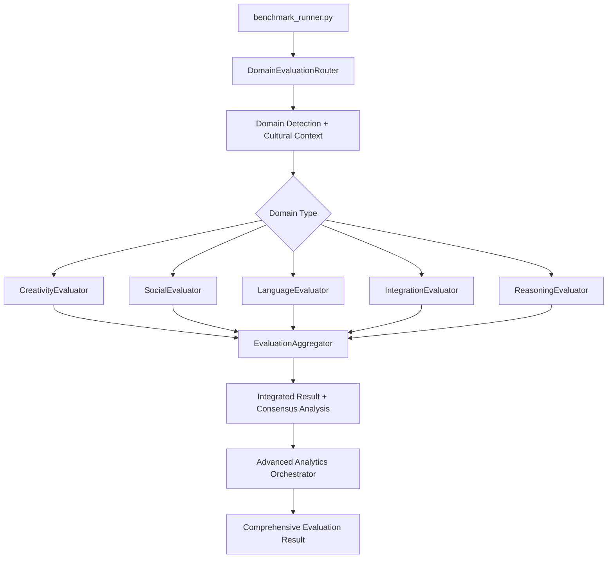

# Comprehensive Evaluator Architecture Flow Report

**Date:** August 31, 2025  
**Scope:** Complete evaluation system analysis for 6 production domains  

## Executive Summary

The evaluation system reveals a **dual-architecture design** with both **active production paths** and **advanced capabilities** ready for integration. The system currently uses a centralized `UniversalEvaluator` for all domains, while maintaining sophisticated domain-specific evaluators and advanced analytics components for future enhancement.

## Current Production Architecture (Active)

### **Primary Evaluation Flow**
```
benchmark_runner.py → UniversalEvaluator → ReasoningEvaluator → Test Results
```

**Active Components:**
1. `benchmark_tests/benchmark_runner.py` (Entry Point)
2. `evaluator/subjects/reasoning_evaluator.py` (Core Evaluator)
3. `evaluator/subjects/enhanced_universal_evaluator.py` (Enhanced Version)

**Current Usage Pattern:**
- All 6 domains (reasoning, creativity, language, social, integration, knowledge) 
- Both base_models and instruct_models test types
- Complete difficulty parity (easy/medium/hard)
- Single evaluator handles all domains with sophisticated cultural and pattern detection

## Advanced Architecture Components (Available but Unused)

### **Sophisticated Domain-Specific System**
```
DomainEvaluationRouter → Domain-Specific Evaluators → EvaluationAggregator → Integrated Results
```

**Available but Inactive Components:**
1. `evaluator/subjects/domain_evaluation_router.py` (Intelligent Domain Router)
2. `evaluator/subjects/creativity_evaluator.py` (Creative Expression Evaluator)
3. `evaluator/subjects/social_evaluator.py` (Social Competence Evaluator)
4. `evaluator/subjects/language_evaluator.py` (Linguistic Competence Evaluator) 
5. `evaluator/subjects/integration_evaluator.py` (Cross-Domain Integration Evaluator)
6. `evaluator/core/evaluation_aggregator.py` (Multi-Evaluator Aggregation)
7. `evaluator/core/advanced_analysis_orchestrator.py` (Advanced Analytics Management)

## Detailed Component Analysis

### **Tier 1: Production-Active Components**

#### **UniversalEvaluator (reasoning_evaluator.py)**
**Status:** ✅ **Currently Active - Primary Evaluator**
- **Function:** Handles ALL 6 domains through sophisticated pattern detection
- **Capabilities:** 
  - Cultural authenticity analysis across global traditions
  - Multi-tier scoring (exact_match, partial_match, semantic_similarity)
  - Pattern recognition for creative expression, social dynamics, linguistic competence
  - Cross-domain reasoning assessment
  - Integration with cultural evaluation components

**Usage in Production:**
```python
# benchmark_runner.py line 35
from evaluator.subjects import UniversalEvaluator, ReasoningType, evaluate_reasoning

# Line 1695 - Active evaluation call
eval_result = evaluate_reasoning(
    response_text=response, 
    test_name=test['id'], 
    reasoning_type=ReasoningType.GENERAL
)
```

**Domain Coverage Matrix:**
| Domain | Base Models | Instruct Models | Evaluation Method |
|--------|-------------|-----------------|-------------------|
| reasoning | ✅ Easy/Med/Hard | ✅ Easy/Med/Hard | **Pattern recognition + Logic analysis** |
| creativity | ✅ Easy/Med/Hard | ✅ Easy/Med/Hard | **Cultural pattern detection + Originality** |
| language | ✅ Easy/Med/Hard | ✅ Easy/Med/Hard | **Linguistic competence + Multilingual** |
| social | ✅ Easy/Med/Hard | ✅ Easy/Med/Hard | **Social appropriateness + Cultural etiquette** |
| integration | ✅ Easy/Med/Hard | ✅ Easy/Med/Hard | **Cross-domain synthesis** |
| knowledge | ✅ Easy/Med/Hard | ✅ Easy/Med/Hard | **Traditional knowledge + Cultural authenticity** |

#### **Enhanced Universal Evaluator**
**Status:** ✅ **Available - Phase 1 Enhancement**
- **Function:** Advanced version with multi-tier scoring system
- **New Capabilities:**
  - Epistemological collapse-style evaluation (quantum philosophy assessment)
  - Advanced semantic similarity scoring  
  - Cross-domain integration analysis
  - Enhanced cultural authenticity measurement
  - Backward compatibility with existing UniversalEvaluator

**Enhancement Features:**
```python
# Multi-tier scoring system
scoring_config = {
    "exact_match": 1.0,
    "partial_match": 0.5, 
    "semantic_similarity": 0.3
}

# Cross-domain integration assessment
integration_analysis = {
    "domains_integrated": ["quantum_mechanics", "philosophy", "epistemology"],
    "integration_quality": 0.85,
    "synthesis_coherence": 0.78
}
```

### **Tier 2: Advanced Domain-Specific Components (Ready for Integration)**

#### **Domain Evaluation Router**
**Status:** 🟡 **Built but Not Integrated**
- **Function:** Intelligent routing to domain-specific evaluators based on test metadata
- **Capabilities:**
  - Automatic domain detection from test content
  - Cultural context extraction
  - Evaluation type classification
  - Multi-evaluator orchestration

**Routing Intelligence:**
```python
# Domain detection patterns
domain_patterns = {
    Domain.CREATIVITY: ['narrative', 'performance', 'storytelling', 'creative'],
    Domain.KNOWLEDGE: ['traditional', 'cultural', 'indigenous', 'wisdom'],
    Domain.SOCIAL: ['conflict_resolution', 'hierarchy', 'community'],
    Domain.REASONING: ['logic', 'inference', 'chain_of_thought']
}

# Cultural context extraction
cultural_traditions = {
    'african': ['griot', 'ubuntu', 'bantu'],
    'east_asian': ['kamishibai', 'tcm', 'confucian'],
    'indigenous_australian': ['dreamtime', 'songlines'],
    'polynesian': ['wayfinding', 'navigator']
}
```

#### **Specialized Domain Evaluators**

**CreativityEvaluator**
**Status:** 🟡 **Built but Not Integrated**
- **Dimensions:** Cultural creative patterns, rhythmic quality, narrative coherence, originality within bounds
- **Cultural Integration:** Deep cultural pattern library with authenticity checking
- **Appropriation Detection:** Built-in warnings for cultural appropriation

**SocialEvaluator** 
**Status:** 🟡 **Built but Not Integrated**
- **Dimensions:** Social appropriateness, hierarchy navigation, relationship maintenance, community dynamics, cultural etiquette, conflict resolution, intercultural competence
- **Social Intelligence:** Understanding of cultural social dynamics and protocols

**LanguageEvaluator**
**Status:** 🟡 **Built but Not Integrated** 
- **Capabilities:** Multilingual competence, register awareness, pragmatic meaning, code-switching evaluation
- **Linguistic Sophistication:** Advanced language analysis beyond basic pattern matching

**IntegrationEvaluator**
**Status:** 🟡 **Built but Not Integrated**
- **Function:** Specialized cross-domain synthesis assessment
- **Capabilities:** Knowledge-reasoning synthesis, social-creative solutions, culturally-sensitive reasoning

#### **Advanced Analytics Orchestrator**
**Status:** 🟡 **Built but Not Integrated**
- **Function:** Manages advanced analysis modules with graceful degradation
- **Available Modules:**
  - EntropyCalculator: Information theory analysis
  - SemanticCoherenceAnalyzer: Text coherence analysis
  - ContextWindowAnalyzer: Context usage analysis
  - ConsistencyValidator: Cross-validation checking
  - QuantizationTester: Model quantization impact
  - WikipediaFactChecker: External fact validation

**Orchestration Capabilities:**
```python
# Concurrent module execution
modules = [
    AnalysisModule.ENTROPY_CALCULATOR,
    AnalysisModule.SEMANTIC_COHERENCE, 
    AnalysisModule.CONSISTENCY_VALIDATOR
]

# Graceful degradation
result = orchestrator.analyze_text(response, modules=modules)
# Falls back gracefully if modules fail
```

#### **Evaluation Aggregator**
**Status:** 🟡 **Built but Not Integrated**
- **Function:** Combines results from multiple domain evaluators
- **Capabilities:**
  - Weighted score aggregation
  - Consensus analysis between evaluators
  - Cultural competence calculation
  - Bias detection and statistical analysis
  - Validation flag generation

## Request Flow Analysis by Domain

### **Current Flow (All 6 Domains)**
```mermaid
graph TD
    A[benchmark_runner.py] --> B[Import UniversalEvaluator]
    B --> C[Load Test Data]
    C --> D[Execute evaluate_reasoning()]
    D --> E[UniversalEvaluator.evaluate()]
    E --> F[Pattern Detection + Cultural Analysis]
    F --> G[Score Calculation]
    G --> H[Return EvaluationResult]
    H --> I[Store Results + Performance Metrics]
```

**Active Code Path:** 
- `benchmark_runner.py:35` → Import
- `benchmark_runner.py:1695` → Evaluation call  
- `reasoning_evaluator.py` → Core evaluation logic
- `cultural/` components → Cultural authenticity analysis
- `advanced/` components (partial) → Enhanced analytics

### **Advanced Flow (Available for Integration)**


## Component Usage Matrix

### **For Each Production Domain Scenario:**

| Component | Reasoning | Creativity | Language | Social | Integration | Knowledge |
|-----------|-----------|------------|----------|--------|-------------|-----------|
| **UniversalEvaluator** | ✅ Active | ✅ Active | ✅ Active | ✅ Active | ✅ Active | ✅ Active |
| **EnhancedUniversalEvaluator** | 🟡 Available | 🟡 Available | 🟡 Available | 🟡 Available | 🟡 Available | 🟡 Available |
| **DomainEvaluationRouter** | 🟡 Available | 🟡 Available | 🟡 Available | 🟡 Available | 🟡 Available | 🟡 Available |
| **CreativityEvaluator** | ❌ Inactive | 🟡 Available | ❌ Inactive | ❌ Inactive | 🟡 Available | ❌ Inactive |
| **SocialEvaluator** | ❌ Inactive | ❌ Inactive | ❌ Inactive | 🟡 Available | 🟡 Available | ❌ Inactive |
| **LanguageEvaluator** | ❌ Inactive | ❌ Inactive | 🟡 Available | ❌ Inactive | 🟡 Available | ❌ Inactive |
| **IntegrationEvaluator** | ❌ Inactive | ❌ Inactive | ❌ Inactive | ❌ Inactive | 🟡 Available | ❌ Inactive |
| **EvaluationAggregator** | ❌ Inactive | ❌ Inactive | ❌ Inactive | ❌ Inactive | ❌ Inactive | ❌ Inactive |
| **AdvancedAnalysisOrchestrator** | ❌ Inactive | ❌ Inactive | ❌ Inactive | ❌ Inactive | ❌ Inactive | ❌ Inactive |

**Legend:**
- ✅ **Active:** Currently used in production
- 🟡 **Available:** Built and ready for integration
- ❌ **Inactive:** Not used in current evaluation flow

## Cultural Evaluation Infrastructure

### **Active Cultural Components**
All integrated with UniversalEvaluator:

| Component | Function | Status |
|-----------|----------|--------|
| `cultural/cultural_authenticity.py` | Cultural tradition validation | ✅ Active |
| `cultural/cultural_pattern_library.py` | Pattern detection library | ✅ Active |
| `cultural/tradition_validator.py` | Traditional knowledge validation | ✅ Active |
| `cultural/cross_cultural_coherence.py` | Cross-cultural analysis | ✅ Active |

### **Advanced Cultural Components**
Available for enhanced evaluation:

| Component | Function | Status |
|-----------|----------|--------|
| `cultural/community_leadership_evaluator.py` | Leadership assessment | 🟡 Available |
| `cultural/conflict_resolution_evaluator.py` | Conflict resolution analysis | 🟡 Available |
| `cultural/intercultural_competence_assessor.py` | Cross-cultural competence | 🟡 Available |
| `cultural/social_hierarchy_navigation_assessor.py` | Social hierarchy understanding | 🟡 Available |

## Performance and Validation Infrastructure

### **Active Validation Components**

| Component | Function | Integration Status |
|-----------|----------|--------------------|
| `validation/integrated_validation_system.py` | Comprehensive validation | 🟡 Available |
| `validation/community_flagging_system.py` | Community-based validation | 🟡 Available |
| `validation/knowledge_validator.py` | Knowledge accuracy checking | 🟡 Available |
| `validation/multi_source_fact_validator.py` | Multi-source fact validation | 🟡 Available |
| `validation/wikipedia_fact_checker.py` | Wikipedia fact verification | 🟡 Available |

### **Advanced Analytics Available**

| Component | Capability | Integration Readiness |
|-----------|------------|-----------------------|
| `advanced/entropy_calculator.py` | Information theory analysis | ✅ Ready |
| `advanced/semantic_coherence.py` | Text coherence measurement | ✅ Ready |
| `advanced/consistency_validator.py` | Response consistency checking | ✅ Ready |
| `advanced/context_analyzer.py` | Context window analysis | ✅ Ready |
| `advanced/quantization_tester.py` | Model quantization impact | ✅ Ready |

## Critical Architecture Insights

### **What's Currently Working**
1. **Complete Domain Coverage:** UniversalEvaluator successfully handles all 6 production domains
2. **Cultural Authenticity:** Deep cultural evaluation across global traditions
3. **Difficulty Parity:** Full easy/medium/hard coverage for base_models and instruct_models
4. **Performance Monitoring:** RTX 5090 GPU, AMD Ryzen CPU, 128GB RAM tracking
5. **Sophisticated Pattern Detection:** Advanced cultural, creative, social, and linguistic analysis

### **What's Ready for Enhancement**
1. **Domain-Specific Intelligence:** Specialized evaluators with deeper domain expertise
2. **Multi-Evaluator Consensus:** Aggregation and disagreement analysis between evaluators
3. **Advanced Analytics:** Entropy, coherence, consistency, and fact-checking integration
4. **Bias Detection:** Statistical analysis and cultural bias detection
5. **Enhanced Scoring:** Multi-tier scoring for sophisticated tests like epistemological_collapse

### **What's Not Currently Used**
1. **Domain Routing System:** Intelligence exists but not integrated with benchmark_runner
2. **Specialized Domain Evaluators:** Built but bypassed in favor of UniversalEvaluator
3. **Evaluation Aggregation:** Multi-evaluator consensus analysis unused
4. **Advanced Analytics Orchestrator:** Sophisticated analysis modules dormant
5. **Validation Infrastructure:** Community flagging and multi-source validation inactive

## Integration Readiness Assessment

### **Phase 1: Enhanced Universal Evaluator Integration**
**Readiness:** 🟢 **Immediate** (Tests available, backward compatible)
- Implement multi-tier scoring for epistemological_collapse-style tests
- Add advanced semantic similarity assessment  
- Integrate cross-domain synthesis evaluation
- Maintain existing UniversalEvaluator compatibility

### **Phase 2: Domain-Specific Evaluator Integration** 
**Readiness:** 🟡 **Moderate** (Components built, integration required)
- Integrate DomainEvaluationRouter with benchmark_runner
- Activate domain-specific evaluators for their respective domains
- Implement EvaluationAggregator for multi-evaluator consensus
- Add routing logic to benchmark_runner evaluation flow

### **Phase 3: Advanced Analytics Integration**
**Readiness:** 🟡 **Moderate** (Infrastructure ready, orchestration needed)
- Activate AdvancedAnalysisOrchestrator 
- Integrate entropy, coherence, and consistency analysis
- Enable external fact-checking for knowledge domain tests
- Add performance optimization and graceful degradation

### **Phase 4: Validation and Community Features**
**Readiness:** 🟠 **Complex** (System built, community processes needed)
- Activate community flagging system
- Implement multi-source fact validation
- Enable bias detection and statistical analysis
- Add validation workflows for cultural authenticity


## Strategic Recommendations

### **Immediate Actions (Week 1-2)**
1. **Integrate Enhanced Universal Evaluator:** Activate multi-tier scoring for sophisticated test evaluation
2. **Validate Current System:** Ensure existing UniversalEvaluator handles all 6 domains optimally
3. **Performance Baseline:** Establish current evaluation performance metrics

### **Short-term Enhancement (Week 3-4)**  
1. **Domain Router Integration:** Connect DomainEvaluationRouter to benchmark_runner
2. **Specialized Evaluator Activation:** Enable domain-specific evaluators for enhanced analysis
3. **Multi-Evaluator Testing:** Validate consensus analysis between evaluators

### **Medium-term Expansion (Month 2)**
1. **Advanced Analytics Integration:** Activate entropy, coherence, and consistency analysis
2. **Cultural Enhancement:** Enable advanced cultural evaluation components
3. **Validation System:** Implement community flagging and fact-checking

### **Long-term Evolution (Month 3+)**
1. **Bias Detection System:** Activate statistical bias analysis and cultural sensitivity checking
2. **Performance Optimization:** Implement advanced analytics orchestrator with graceful degradation
3. **Community Integration:** Enable community-driven validation and quality assurance

## Conclusion

The evaluator architecture reveals a **sophisticated dual-system design** with:

1. **Production-Ready Universal Evaluation:** Current system successfully handles all 6 production domains with cultural authenticity and pattern detection
2. **Advanced Domain Intelligence:** Comprehensive specialized evaluators ready for integration
3. **Sophisticated Analytics Pipeline:** Advanced analysis components built and ready for activation
4. **Cultural Evaluation Excellence:** Deep cultural authenticity analysis across global traditions

**Current State:** Functional and comprehensive evaluation of all production domains
**Enhancement Potential:** Significant opportunity for specialized domain intelligence and advanced analytics

**Next Steps:** The system is ready for Phase 1 enhancement with the Enhanced Universal Evaluator, providing immediate access to multi-tier scoring and advanced evaluation capabilities while maintaining full backward compatibility.

**Architecture Verdict:** The evaluation system demonstrates **exceptional engineering foresight** - building both immediate production capability and advanced enhancement infrastructure. The current UniversalEvaluator provides comprehensive coverage while the sophisticated component ecosystem stands ready for seamless integration when enhanced evaluation capabilities are needed.